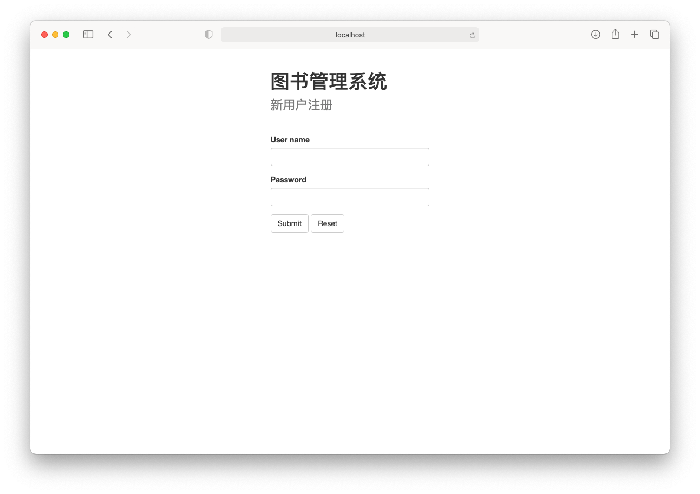
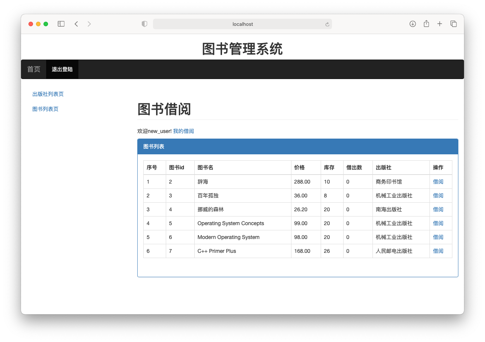
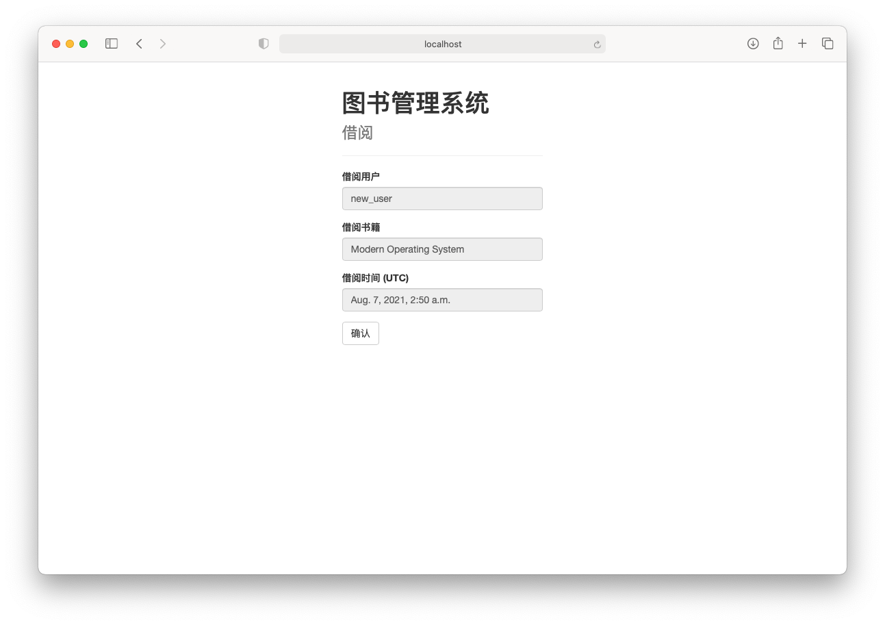
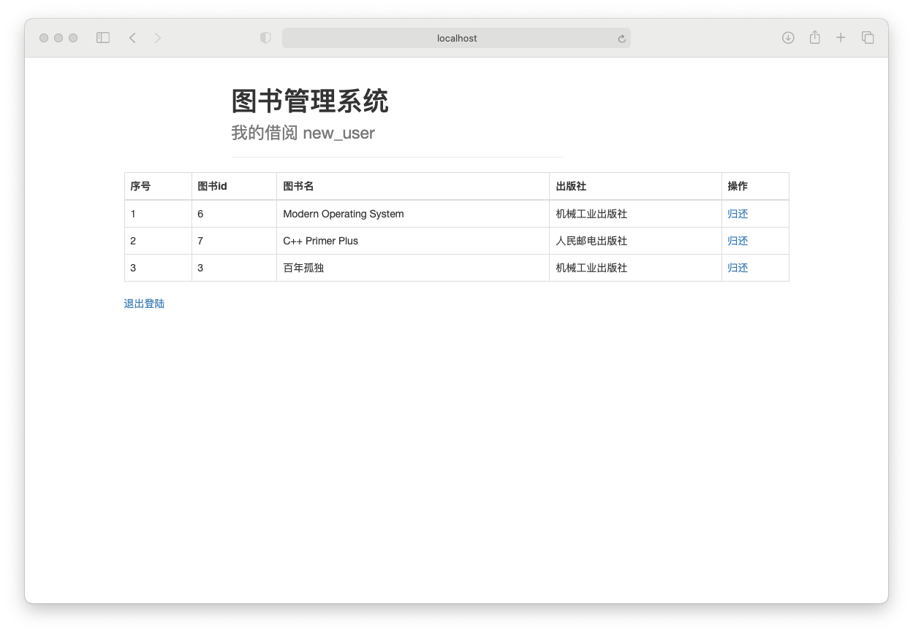
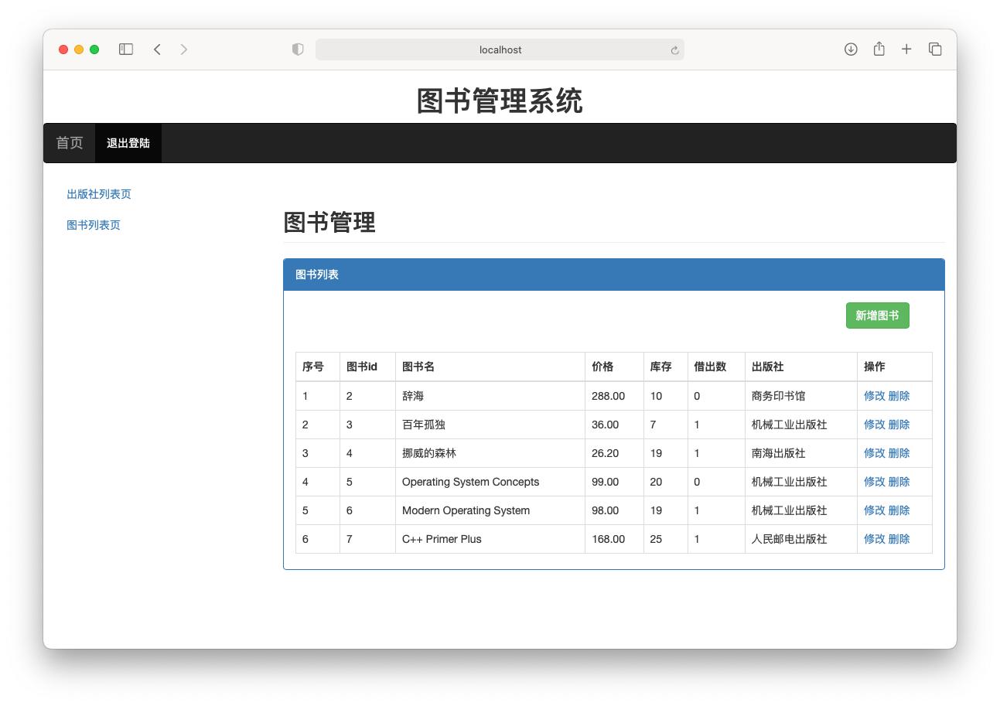
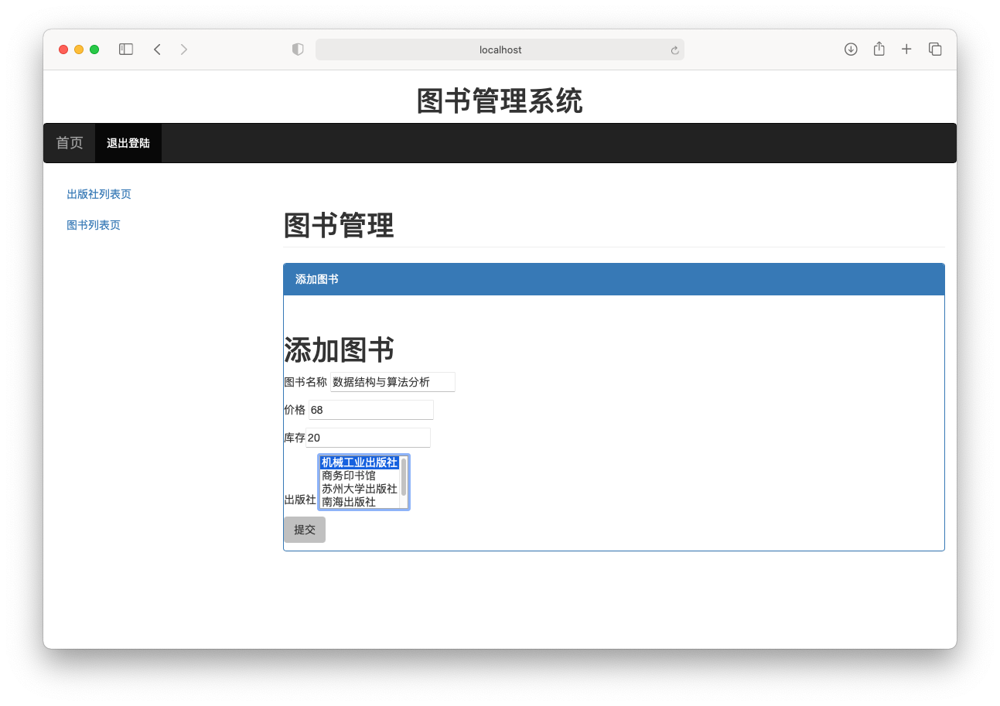
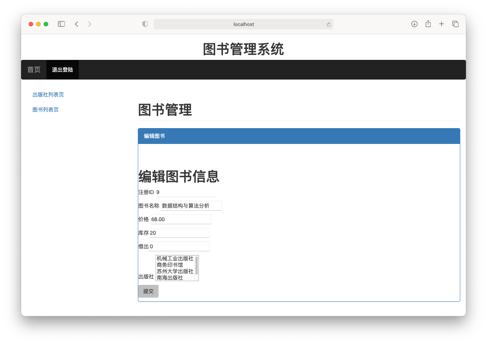
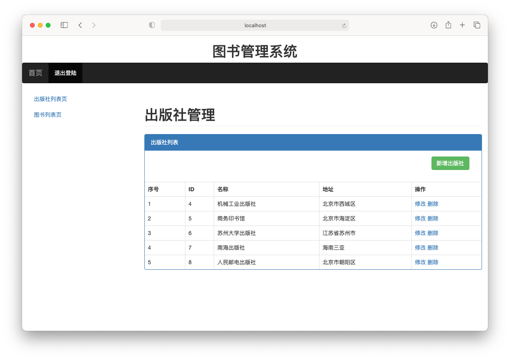
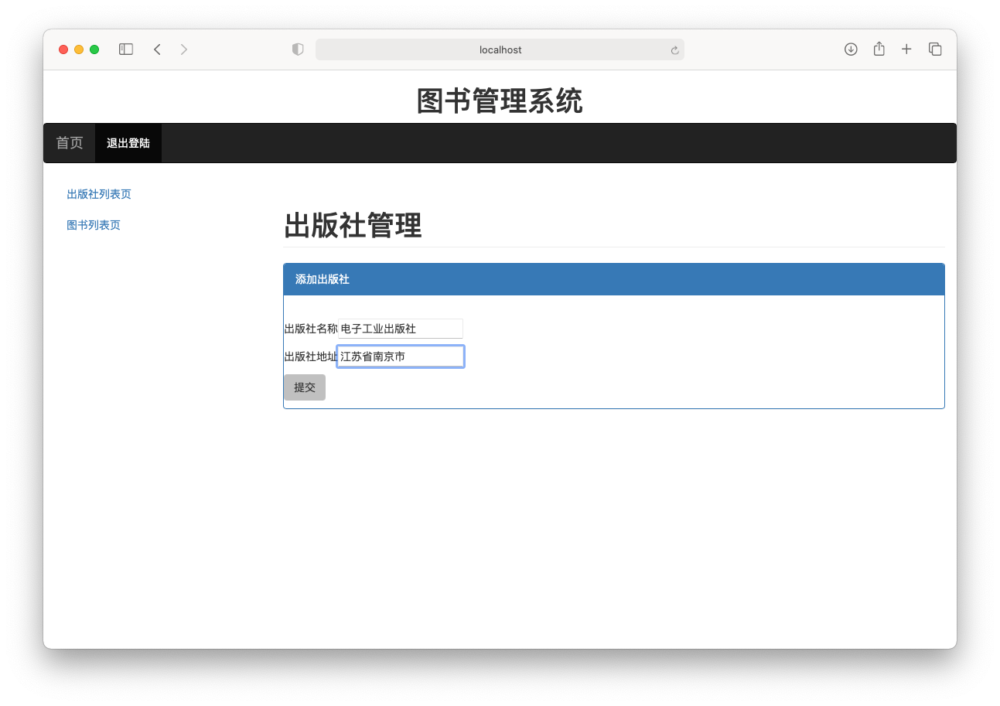
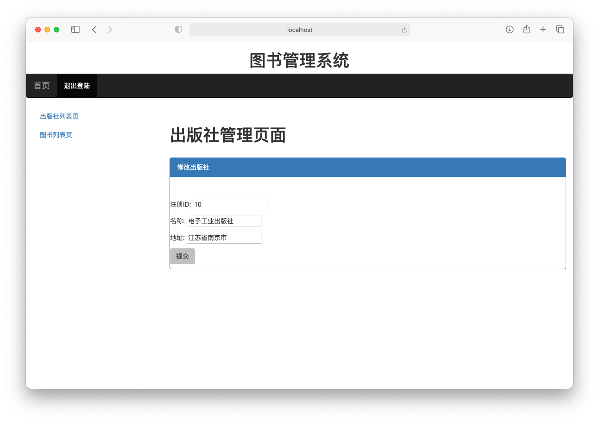

# 基于Python的图书管理系统

2021年暑期企业实训课程设计


## 简介

​	这是一个使用Python编写的基于Django和BootStrap的图书管理系统，适用于图书馆的图书借阅管理。因处于考研复习的关键时期，时间有限，故本系统编写得不是很完善，有不少bug，还望见谅。


## 编写环境

- CPU: Apple M1
- RAM: 8G
- OS: macOS Big Sur 11.5.1
- IDE: PyCharm Professional 2021.2
- Python: 3.9
- Django: 3.2.6
- MySQL: 5.7


## 环境配置

```shell
# Unix or Linux
cd /your_file_path_here/libraryProject
source venv/bin/activate

# Windows
cd /your_file_path_here/libraryProject/venv/bin
activate
cd ..
cd ..

# Unix, Linux or Windows
pip install --upgrade pip

pip install Django

pip install pymysql

# before this command, your need to set up mysql
python manage.py makemigrations

python manage.py migrate

python manage.py runserver

#visit 127.0.0.1:8000/app01/ in your browser
```


## 功能说明与运行截图

### 登录页面

​	在此页面上输入用户名和密码，点击Submit按钮后可以登陆系统，若用户名密码正确，则跳转到图书借阅页面，若使用管理员账号（admin）登陆，将跳转到图书管理页面。若用户名密码为空或错误，将清空输入并重定向到本页面。点击新用户注册会跳转到注册页面。


### 注册页面

​	在此页面上可输入用户名与密码，点击Submit按钮进行注册，注册成功后会跳转回登陆页面。点击Reset按钮会清空输入。



### 图书借阅页面

​	本页面会显示当前登陆的用户名，图书列表中会列出数据库中可供借阅的图书的信息，点击“借阅”连接会跳转到对应图书的借阅页面。点击“我的借阅”会跳转到当前登录账户已借阅的书籍列表页面。点击”退出登录“按钮会退出登录，并跳转到系统登录页面。



### 图书借阅确认页面

​	本页面会显示当前用户所选择借阅的书籍名称及借阅时间（UTC），点击“确认”按钮后会向服务器提交借阅信息，服务器将借阅记录写入数据库。此处的三个文本框都为只读模式。



### 我的借阅页面

​	我的借阅页面会显示当前登录账户所借阅的所有书籍，点击“归还”链接会向服务器提交归还信息，服务器会向数据库中写入相应还书记录。点击“退出登录”按钮，会退出当前账户，并返回登录页面。



### 图书管理页面（管理员视图）

​	本页面是管理员进行图书管理相关操作的页面，点击“新增图书”按钮会跳转到添加图书页面，点击“修改”链接会跳转到相应图书的信息编辑页面，点击“删除”链接会删除数据库中相应的图书记录。点击”退出登录“按钮会退出登录，并跳转到系统登录页面。点击“出版社列表页”链接会跳转到出版社管理页面。



### 添加图书页面（管理员视图）



### 编辑图书页面（管理员视图）

​	本页面可以修改已录入图书的信息，但是“注册ID”文本框为只读模式，不可修改。



### 出版社管理页面（管理员视图）

​	本页面是管理员进行出版社管理相关操作的页面，点击“新增出版社”按钮会跳转到添加出版社页面，点击“修改”链接会跳转到相应出版社的信息编辑页面，点击“删除”链接会删除数据库中相应的出版社记录。点击”退出登录“按钮会退出登录，并跳转到系统登录页面。点击“图书列表页”链接会跳转到图书管理页面。



### 添加出版社页面（管理员视图）



### 编辑出版社信息页面（管理员视图）

​	本页面可以修改已录入的出版社信息，但是“注册ID”文本框为只读模式，不可修改。



Copyright ©️ 2021 niceNASA
